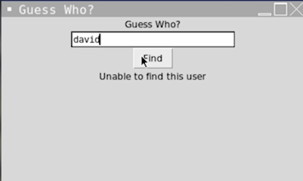

# Challenge for Day 68

## Guess who (Part 2)

For today's challenge, you need your code from Day 67.

1. Start the program with no image displayed. 
2. If the user inputs a name that can't be found, a new label should appear in the image location saying 'Unable to find image'.

🥳 Extra points for getting all the inputs with just one input command and the split function.

### Example:

> 💡 Hints
> - Create the error label in the main program.
> - If the image can't be found, hide the canvas and pack the error label.
