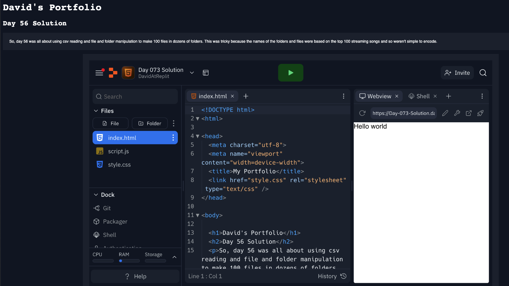

# Challenge for Day 76

## Flask

Today's challenge is to create a Flask web server with two website endpoints.

Your program should:

1. Have a `/portfolio` which displays your portfolio page.
2. Have a `/linktree` which displays your linktree page.

### Example:

> 💡 Hints:
> - Make sure you have a 'static' folder for all of your media and **CSS** files.
> - You may need to rename one CSS file to avoid having two with the same name.
