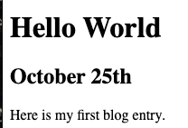

# Challenge for Day 77

## Flask templates

Today's challenge is to set up a simple template for a blog.

Your template should:

1. Have a space for a heading
2. Have a space for today's date
3. Have a space for the text.
- Now write two different blog entries and serve them on two different endpoints.
- The blog entries should both use the same template, and have shortened redirects to their URLs.

### Example:

> 💡 Hints:
> - Don't forget `f = open()` and `f.read()` to get the HTML into python from your template page file.
