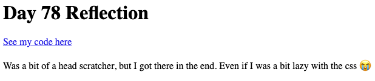

# Challenge for Day 78

## Reflections

Today's challenge is to build a place to store your reflections on the next 22 days of code.

👉 To help you achieve this, here's one more skill.

In the code below, I have used a variable in chevrons to pull in anything past the first `/` in the URL.

I can then use that in my definition and call it for use in my page. Here's the code

```python
from flask import Flask

app = Flask(__name__)

@app.route('/<page_number>')
def index(page_number):
    return f'This is page {page_number}'
```

Now, I can put a / at the end of the URL in my browser, and whatever I type in will be used in the output on the page.

👉 Your program should:

1. Have a template for the page accessible by going to URL/dayNumber (eg myLovelyWebsite/78)
2. Each page should have:
   - The day number in a title
   - A link to your repl
   - Your reflections in the text
3. Each page should be nicely styled with CSS.
4. If I go to the page in a browser, and change the number after the / it should load the relevant page.

### Example:



> 💡 Hints
> - The easiest way to store all your page content is in a 2D dictionary or list that you look up and replace the variables in the Flask code with the content from your dictionary/list.
