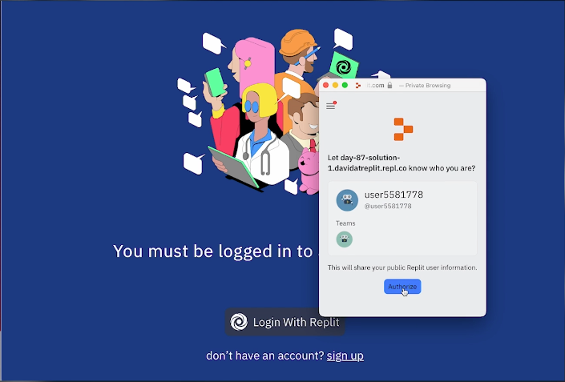

# Challenge for Day 87

## Authentication

Today's challenge is to edit your login page for blog engine system from yesterday. You should end up with significantly less code than you had before.

Your program should:

1. Change the login button to forward the user to the edit page.
2. On the edit page, check that it's you. If not, kick the user back to the main page.

### Example

