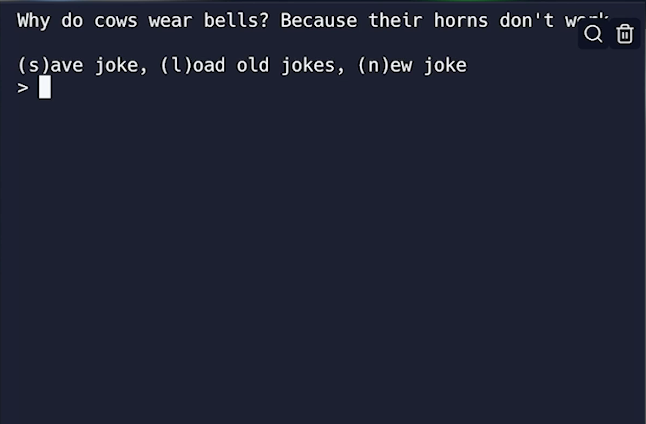

# Challenge for Day 91

## The Joke's on You!

Today's challenge is to build a program from this basic principle that will:

1. Give you a random joke.
2. Ask if you want to save it.
3. If you do, it should:
   - Save the joke ID number to a replit db
4. Ask the user if they want to see the saved jokes and output the contents of the database.

### Example

> 💡 Hints:
> - Check out the fetching a specific joke examples on the [icanhazdadjoke API](https://icanhazdadjoke.com/api).
