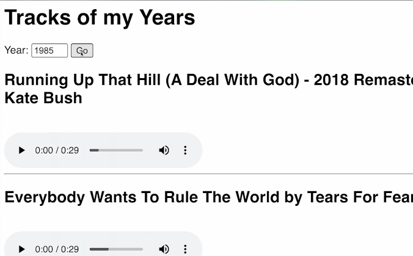

# Challenge for Day 93

## Spotify API - What's Your Top Ten?

Today's challenge is a biggie!

Take the code that turns your repl into a Flask App (delete what's in `main.py` and insert your code).

1. Build a website with a form.
2. The user should input a year and click 'go'
3. Construct a query using the year input.
4. Show 10 songs from that year
5. Use this piece of code to wrap the link for each song into an embedded mp3

```html
<audio controls>
  <source src="{url}" type="audio/mpeg">
</audio>
```

Extra points for adding an offset, so that the program shows the next ten every time a person searches for a particular year.

### Example



> 💡 Hints:
> - Don't forget to format the search URL as an fString and drop the {year} in there.
