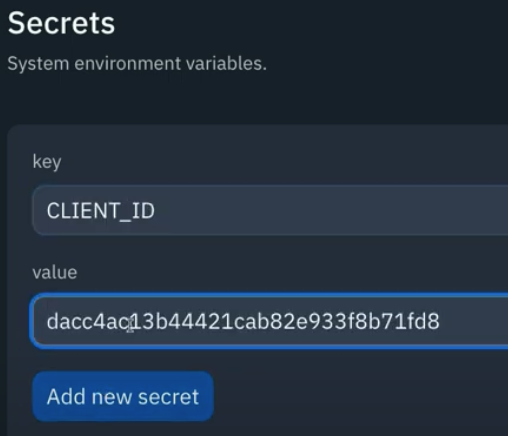

# API? Spotify? Verify!

The APIs we've been using so far are pretty unusual in that they provide their service for free.

Normally, you have to pay to use an APIs data services (at least if you're doing so commercially). This means that you will need to verify your status as an approved user before you can get your grubby hands on all of that sweet, sweet data!

Today, we're learning how to write a program that tells an API that we've got an account before accessing its info.

Don't worry, you won't have to bust out the credit card. We're using a Spotify API that won't charge provided we keep our usage under a certain level.
## Get started 
👉  [Click here to go to the Spotify developer page](https://developer.spotify.com/dashboard/) and log in/create an account.

👉 Next, hit *create app* and give it a name and description.

👉 Copy the **client ID** and **insert it as a secret in your REPL**.  Make sure to call it **CLIENT_ID**.

## Client Secret
👉 Back to Spotify and click **show client secret** (use your own, not the one in these screenshots, I'll have changed it by the time this goes out).

Again, copy and create a REPL secret for it - **CLIENT_SECRET**.

Now we have, effectively, the username and password that our program needs so that it can talk to Spotify.