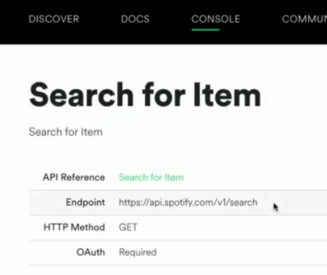

# Authenticate

Now we have access to a whole bunch of music related data. You can find and test all of the different category data on the spotify API page in the **categories** tab.

## Connect to Spotify
👉  First though, we need to connect our program to Spotify. Step 1 is to import a bunch of libraries. Line 2 is a new library that authenticates our Spotify credentials against their API.

```python
import requests, json, os
from requests.auth import HTTPBasicAuth
```

👉 Then bring in our secrets and assign to variables.

```python
import requests, json, os
from requests.auth import HTTPBasicAuth

clientID = os.environ['CLIENT_ID']
clientSecret = os.environ['CLIENT_SECRET']
```
## Authenticate
👉 Now to authenticate with Spotify's system. This is tricky the first time, but after that you'll have the code that you can reuse.

Authenticating gives you a **token** (a series of seemingly random numbers & letters) that is the *'I'm allowed in here'* pass for your program.

There's a lot going on here. So, here's the breakdown:
- I've set up variables to store the data needed for authentication.
  - `url` stores the web address to connect to
  - `data` creates a dictionary that communicates with the API in the correct way. It basically says to Spotify _'Send me back the credentials based in my client ID and secret. Here's a dictionary format to put them in'._
  - `auth` uses the new `HTTPBasicAuth` function to send your client ID and secret to Spotify as pretty much the username and password to log you in.
  - `response` stores the API key that will be returned by the `requests` function that sends Spotify the login info needed.
- After that, I've added some `print` functions to output the info we get back for testing purposes.


```python
url = "https://accounts.spotify.com/api/token"
data = {"grant_type":"client_credentials"}
auth = HTTPBasicAuth(clientID, clientSecret)

response = requests.post(url, data=data, auth=auth)

print(response.ok)
print(response.json())
print(response.status_code)
```
## Whole code so far
Once I've tested the prints and I know that it's all working, I can remove them and extract the access token. Here's the whole code so far:

```python
import requests, json, os
from requests.auth import HTTPBasicAuth

clientID = os.environ['CLIENT_ID']
clientSecret = os.environ['CLIENT_SECRET']

url = "https://accounts.spotify.com/api/token"
data = {"grant_type":"client_credentials"}
auth = HTTPBasicAuth(clientID, clientSecret)

response = requests.post(url, data=data, auth=auth)
accessToken = response.json()["access_token"]
```

## Set up a search
👉 Now let's set up a search form Spotify. I've gone to the API page, selected **console > search** and grabbed the endpoint details.



👉 I've inserted it into my repl in the `url` variable (I can reuse it because it's done it's job of logging me in earlier).  Additionally, I've set up a `headers` variable that will enable communication with the Spotify API using my access token as a pass.
```python
url = "https://api.spotify.com/v1/search"
headers = {'Authorization': f'Bearer {accessToken}'}
```

