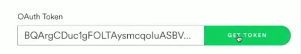
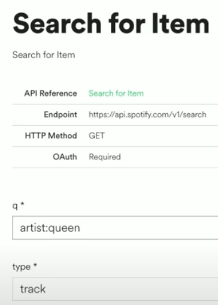
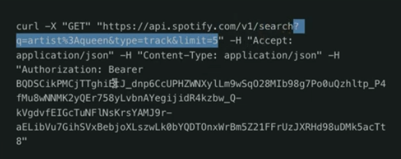

# Access Token

👉 Back to Spotify now, and let's search for an artist. Copy your access token (you may need to print it out again) and paste it into the **OAuthToken** box in Spotify. Then click **request**.



## Fill in the details

👉 Now fill in the rest of the details in the Spotify search menu. You can see lots of examples of what to search for on the [API reference page](https://developer.spotify.com/documentation/web-api/reference/#/operations/search). Then click **Try It** and scroll down to see the JSON on the right of the screen. 


## Grab part of the query
👉 Next I'm going to grab part of the query from the Spotify page and bring it into a variable in my Repl. The part that I've grabbed specifies that I'm searching for tracks by 'Queen', and I only want to display 5 results.

```python
search = "?q=artist%3Aqueen&type=track&limit=5"
```
## The full query
Next, create the full query by concatenating the `url` and `search` variables.  I've included the full code here. The new line is the last one.

```python
import requests, json, os
from requests.auth import HTTPBasicAuth

clientID = os.environ['CLIENT_ID']
clientSecret = os.environ['CLIENT_SECRET']

url = "https://accounts.spotify.com/api/token"
data = {"grant_type":"client_credentials"}
auth = HTTPBasicAuth(clientID, clientSecret)

response = requests.post(url, data=data, auth=auth)

accessToken = response.json()["access_token"]

url = "https://api.spotify.com/v1/search"
headers = {'Authorization': f'Bearer {accessToken}'}
search = "?q=artist%3Aqueen&type=track&limit=5"

fullURL = f"{url}{search}"
```

👉 At last! Time to send that url off and get some results from it.  I also need to send the headers to get authorization.

I've also used a loop to strip out just the track names and output them.
## Preview the song
Spotify also includes a cool *preview URL* - a 30 second sample of the song, so I've added a link to that sample as part of the output.

```python
response = requests.get(fullURL, headers=headers)

for track in data["tracks"]["items"]:
  print(track["name"])
  
```
## Making this customizable
👉So how about making our search user customizable?
In the code below, I have:
- Asked the user to input an artist (line 14)
- Tidied up their input (line 15)
- formatted the `search` URL as an fString that includes the artist (line 19)
  
Here's the code:

```python
import requests, json, os
from requests.auth import HTTPBasicAuth

clientID = os.environ['CLIENT_ID']
clientSecret = os.environ['CLIENT_SECRET']

url = "https://accounts.spotify.com/api/token"
data = {"grant_type":"client_credentials"}
auth = HTTPBasicAuth(clientID, clientSecret)

response = requests.post(url, data=data, auth=auth)
accessToken = response.json()["access_token"]

artist = input("Artist: ").lower()
artist = artist.replace(" ", "%20")

url = "https://api.spotify.com/v1/search"
headers = {'Authorization': f'Bearer {accessToken}'}
search = f"?q=artist%3A{artist}&type=track&limit=5"

fullURL = f"{url}{search}"

response = requests.get(fullURL, headers=headers)
print(json.dumps(data, indent=2))  

for track in data["tracks"]["items"]:
  print(track["name"])
  print(track["preview_url"])

```
